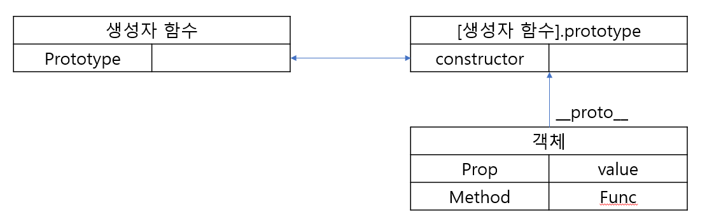
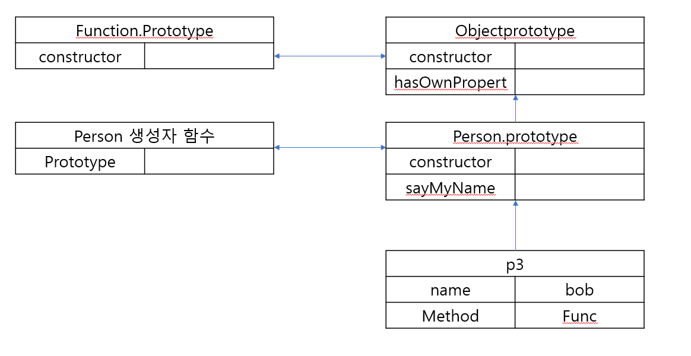

# Prototype

<hr>

자바스크립트에서는 객체간 상속을 구현하기 위해 Prototype 객체를 사용한다. 모든 객체는 하나의 Prototype 객체를 가지며 모든 Prototype은 생성자 함수와 연결되어 있다. Prototype을 통해 불필요한 메모리 낭비나 중복을 제거한다.

### Prototype을 통해 메서드 공유

Prototype을 통해 공유되는 메소드를 정의 할 수 있다. 아래 예시에서 gretting 메소드가 생성자 함수 내에 정의 되어 있을 경우 생성자 함수를 통해 생성되는 인스턴스마다 gretting 메소드를 생성해 메모리를 낭비한다.

```
// Prototype의 기본 사용
function Person(name) {
  this.name = name;
  gretting() = function () {
    // 공유하는 메소드라면 이곳에 정의하지 않고 Prototype을 이용한다.
  }
}

Person.prototype.gretting = function () {
  return "hi";
};

const p1 = new Person("bob");
const p2 = new Person("pop");
p1.gretting(); //hi
p2.gretting(); //hi
```

### **proto** 접근자 프로퍼티

모든 객체는 `__proto__`인 접근자 프로퍼티를 통해 자신의 Prototype에 접근할 수 있다. 이 접근자 프로퍼티는 객체가 직접 소유하고 있는 것이 아니라 Object.prototype의 상속을 통해 사용이 가능하다. 따라서 생성자 함수를 통해 새로 생성된 객체가 `Object.prototype`에 있는 `hasOwnProperty`, `toString` 등의 메소드를 사용할 수 있다.



### 프로토타입 체인

> 자바스크립트는 객체의 프로퍼티에 접근하려고 할 때 해당 객체에 접근하려는 프로퍼티가 없다면 [[Property]] 내부 슬롯의 참조를 따라 자신의 부모 역할을 하는 프로토타입의 프로퍼티를 순차적으로 검색한다. 이를 프로토타입 체인이라한다. 프로토타입 체인은 자바스크립트가 객체지향 프로그래밍의 상속을 구현하는 매커니즘 이다.<br><br> > [모던 자바스크립트 딥 다이브]

```
function Person(name) {
  this.name = name;
}

Person.prototype.sayMyName = function () {
    return `my name is ${this.name}`;
  };
}

const p3 = new Person("bob");
console.log(p3.sayMyName()); // my name is bob
console.log(p3.hasOwnProperty("name")); // true
console.log(p3.hasOwnProperty("tel")); // false
```

1. Person 생성자 함수를 통해 생성된 p3 객체는 객체 내의 `sayMyName` 프로퍼티를 찾는다
2. 해당 프로퍼티가 없기 때문에 프로토 타입 체인에 따라 [[prototype]]에 바인딩 되어 있는 `Person.prototype` 에서 프로퍼티를 찾는다
3. `Person.prototype` 의 `sayMyName` 메소드를 실행한다.
4. `hasOwnProperty` 메소드의 경우 `Person.prototype`에서 검색하고 다시 바인딩 되어 있는 `Object.prototpye`에서 검색후 메소드를 실행한다. 만약 프로토타입에 정의되지 않는 프로퍼티일 경우 undefined을 반환한다.


